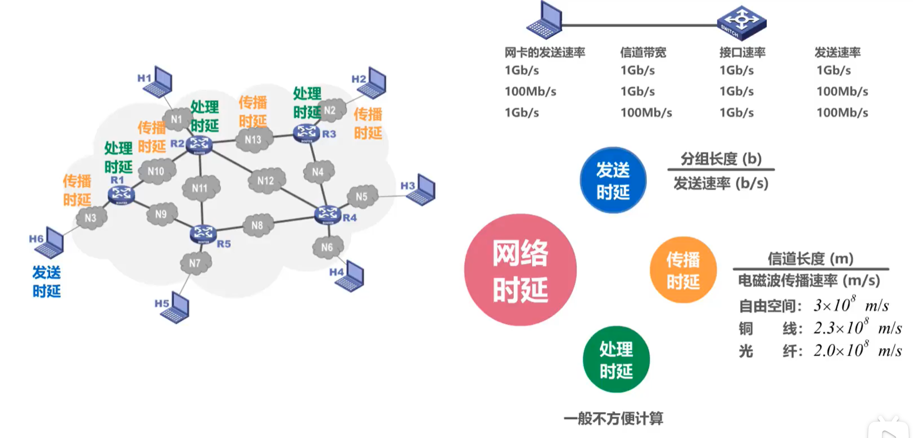
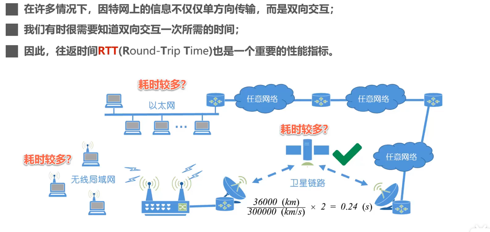
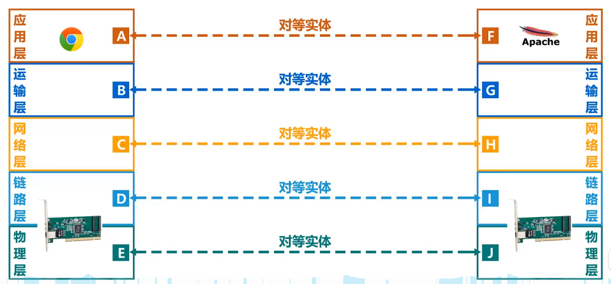

# 一、概论
## 1. 计算机网络分类
   

## 2. 计算机网络的性能指标：
|指标|作用|单位|
|-|-|-|
|速率|主机在数字信道上传送比特的速率|bps|
|带宽|网络在通信线路上传播数据的能力|bps|
|吞吐量|单位时间内通过网络的数据量|bps|
|时延|报文或分组从网络的端到端所需时间|s|
|时延带宽积|传播时延和带宽的乘积|Byte|
|往返时间|因特网上信息双向交互所需时间|s|
|利用率|信道被利用的时间所占比例|%|
|丢包率|反映网络拥塞情况|%|

1. 速率：连接在计算机网络上的主机在数字信道上传送比特的速率，单位bps/Kbps/Mbps/Gbps/Tbps
    > 速率每个单位之间差1000倍：Mbps=1000Kbps=$10^3$KB
    > 
    > 数据量每个单位之间差1024倍：MB=1024MB=$2^{10}$MB
    > 
    > 
2. 带宽：用来表示网络的**通信线路**所能传送数据的能力，单位bps/Kbps/Mbps/Gbps/Tbps
3. 吞吐量：在单位时间内通过某个网络的数据量
4. 时延：单位s

    
5. 时延带宽积=传播时延(s)×带宽(bps)：单位Byte
6. 往返时间（RTT）：单位s

    
7. 利用率：
    - 信道利用率：用来表示某信道有百分之几的时间是被利用的（有数据通过）
    - 网络利用率：全网络的**信道利用率**的加权平均。
    > 信道利用率不是越高越好
8. 丢包率：一定时间范围内，**传输过程中丢失的分组数量与总分组数量的比率**
    - 无拥塞时路径丢包率为0%
    - 轻度拥塞时路径丢包率为1%～4%
    - 严重拥塞时路径丢包率为5%～15%
## 3. 计算机网络体系结构
   


TCP/IP体系结构：采用四层结构（应用层、传输层、网络层、网络接口层），其中网络接口层可以被分为数据链路层和物理层

网络通信举例：（HTTP响应报文从Web服务器 传输到 主机）
```mermaid
graph TD
    A["HTTP响应报文需要在Web服务器层层封装"]-->|HTTP报文+TCP报文段+IP首部+帧的首部尾部+前导码|B["通过传输媒体传输到路由器"]
    B-->C["路由器转发给主机"]
    C-->D["逐层解封，取出HTTP响应报文"]
   ```
## 4. 计算机网络体系结构中的专业术语
1. 实体: 任何可发送或接收信息的硬件或软件进程

   对等实体: 收发双方相同层次中的实体。
   
   
2. 协议：控制两个对等实体进行逻辑通信的规则的集合
   - 协议三要素：语法、语义、同步
     - 语法：信息格式
     - 语义：信息内容
     - 同步：收发双方的时序关系
3. 服务：本层向上一层提供服务
   - 服务访问点：在同一系统中相邻两层的实体交换信息的逻辑接口，用于区分不同的服务类型。数据链路层的服务访问点为帧的“类型”字段。
   - 服务原语：上层使用下层所提供的服务必须通过与下层交换一些命令，这些命令称为服务原语。
   - PDU: 协议数据单元
   - SDU: 服务数据单元（多个SDU可以合成一个PDU）

   
   > 协议是<font color=FF0000>水平</font>的，服务是<font color=FF0000>垂直</font>的