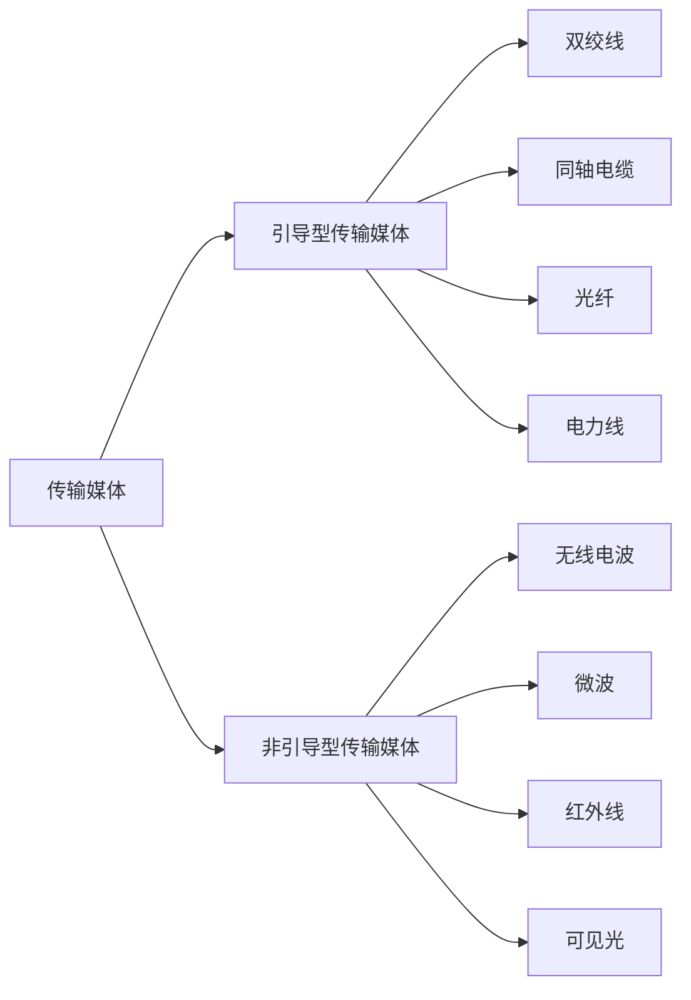
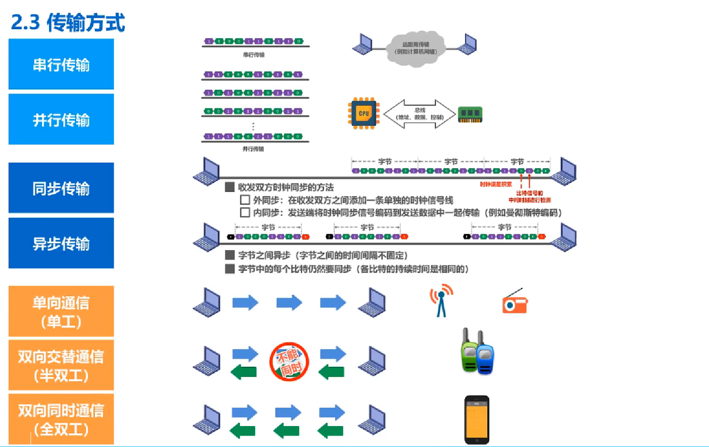
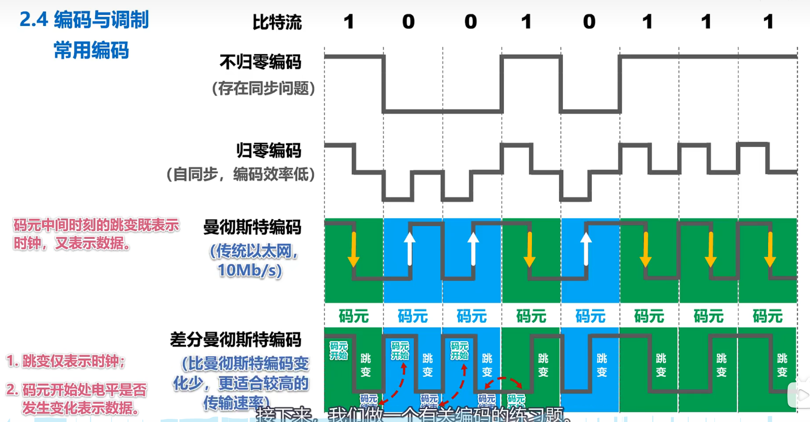
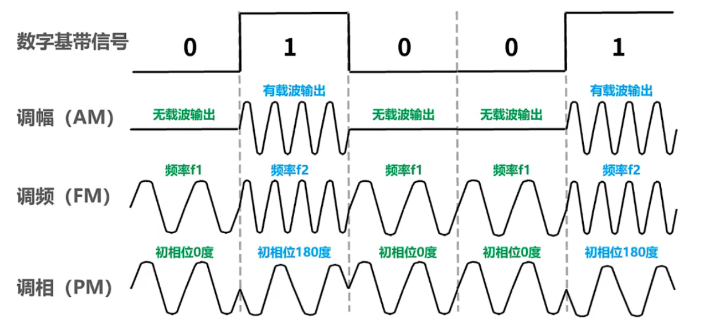

# 二、物理层
## 1. 物理层基本概念

物理层考虑的是怎样才能在连接各种计算机的传输媒体上传输数据比特流。

物理层为数据链路层屏蔽了各种传输媒体的差异，使数据链路层只需要考虑如何完成本层的协议和服务
## 2. 物理层下面的传输媒体

## 3. 传输方式

> **计算机内部**数据传输一般使用 并行传输
> 
> **计算机网络**中数据在传输线路上的传输采用 串行传输

## 4. 编码与调制
计算机网络中，常见的方法是将**数字基带信号**通过**编码或调制**的方法在相应信道（数字信道/模拟信道）传输

- 编码

  
- 调制
  
  
- 码元
  
  一段调制好的基本波形，可以表示比特信息

## 5. 信道的极限容量
- 信号失真原因：
  - 码元传输速率
  - 信号传输距离
  - 噪声干扰
  - 传输媒体质量
- 奈氏准则：

  在假定的理想条件下，为了避免码间串扰，码元传输速率（/波特率/调制速率）是有上限的。
  
  理想低通信道的最高码元传输速率＝2W Baud＝2W码元／秒

  理想带通信道的最高码元传输速率＝W Baud ＝W码元／秒

  > W：信道带宽 (单位为Hz)，代表信道的传输能力
  > - 在模拟信道，带宽按照公式W=f2-f1 计算；
  > - 数字信道的带宽为信道能够达到的最大数据速率，两者可通过香农定理互相转换。
  > 
  > Baud：波特，即码元／秒（波特率=n×比特率，n为一个码元携带的比特量）
  > 
  > 使用更好的调制方法（多元制）可以提高信息阐述速率
- 香农公式：带宽受限且有高斯白噪声干扰的信道的极限信息传输速率$$c=W×log_2(1+\displaystyle\frac{S}{N})$$
  > $\frac{S}{N}$: 信噪比
  > 
  > 信道中信噪比越大，信息的极限传输速率越高