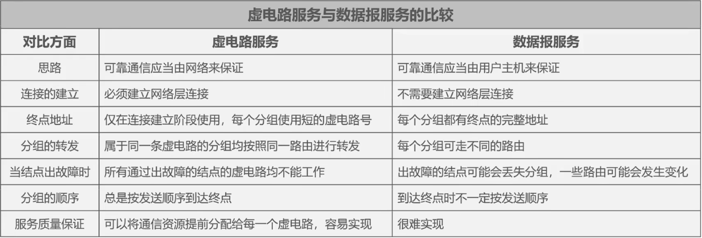
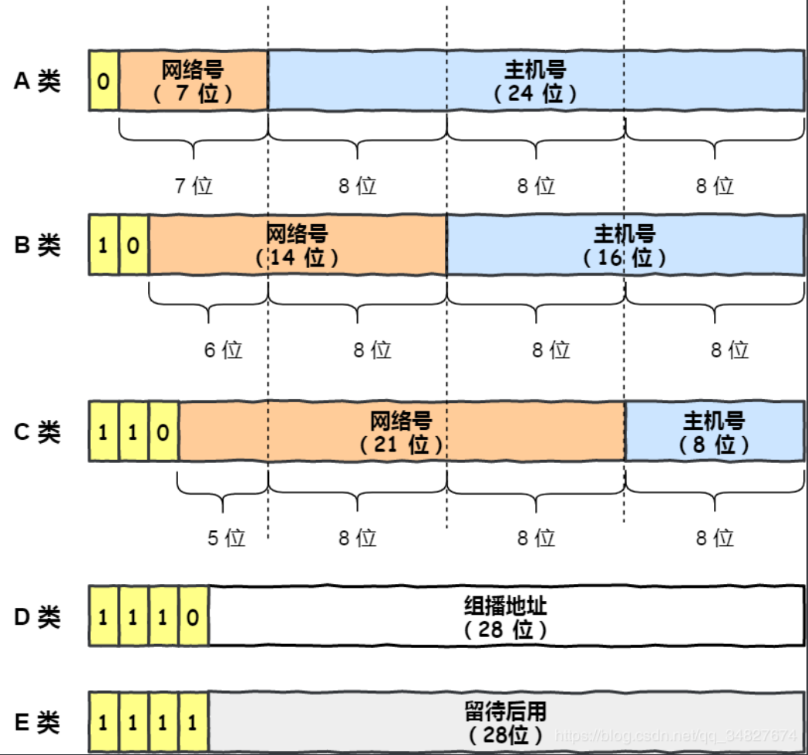
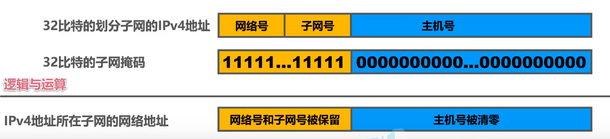
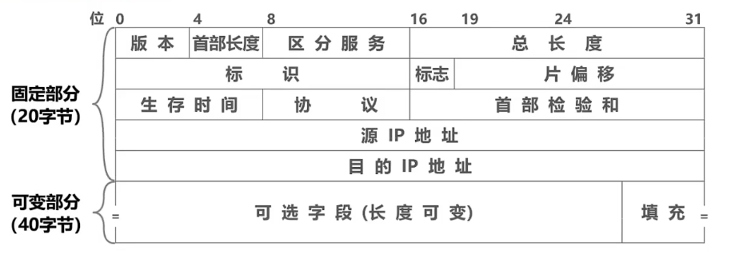
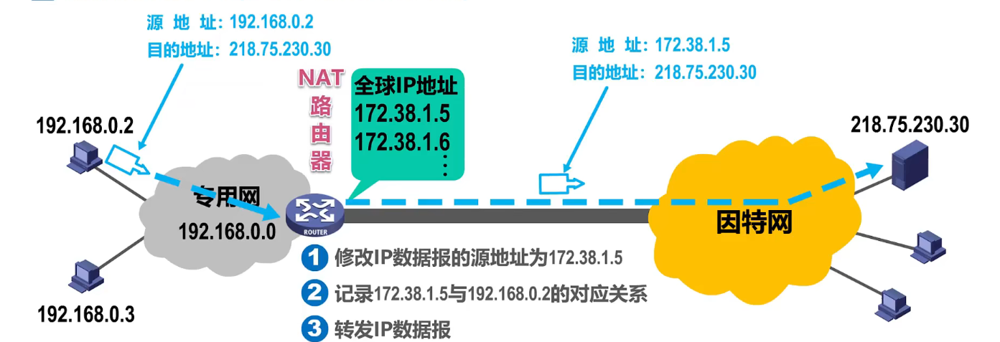
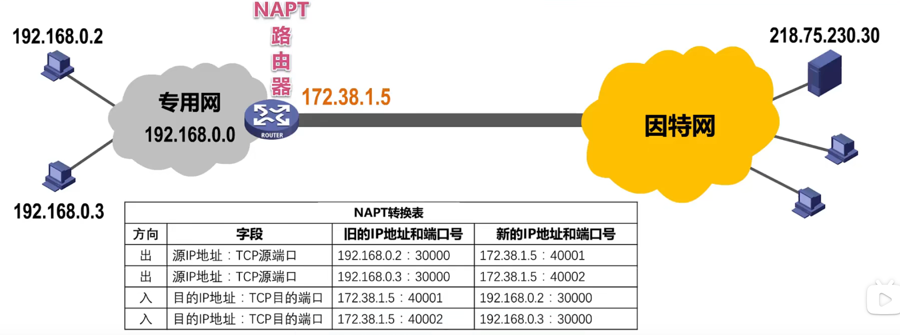

# 四、网络层
## 1. 网络层概述
- 网络层的主要任务是实现**网络互连**，进而实现数据包在各网络之间的传输。
- 网络层的三个主要问题：
  - “可靠传输”还是“不可靠传输”
  - 网络层寻址问题
  - 路由选择问题
  
## 2. 网络层提供的两种服务
1. 面向连接的虚电路服务
2. 无连接的数据报服务
   > **因特网的先驱者采用了无连接的数据报服务**

   

## 3. IPv4
IPv4地址就是给因特网上的每一台主机（或路由器）的每一个接口分配一个在全世界范围内是唯一的32比特（每8比特1组）的标识符。
- 分类编址的IPV4地址
  
  

  |网络类别|IP地址范围|每个网络中最大主机数量(=$2^{主机号位数}-2$)|
  |-|-|-|
  |A|0.0.0.0~127.255.255.255| $2^{24}-2=16777214$ |
  |B|128.0.0.0~191.255.255.255| $2^{16}-2=65534$ |
  |C|192.0.0.0~223.255.255.255| $2^{8}-2=254$ |
  > 每个网络中最大主机数量=$2^{主机号位数}-2$中“-2”是因为要去掉主机号为"全0"的网络地址和主机号为"全1"的广播地址
- 划分子网的IPv4地址
  
  32比特的子网掩码可以表明分类IP地址的主机号部分被借用了几个比特作为子网号
  - 子网掩码使用连续的比特1来对应网络号和子网号
  - 子网掩码使用连续的比特0来对应主机号
  - 将划分子网的IPv4地址与其相应的子网掩码进行逻辑与运算就可得到IPv4地址所在子网的网络地址
  
  
  > 主机号为全0是网络地址；主机号为全1是广播地址
- 无分类编址的IPv4地址
  - CIDR记法
    > 例：`128.14.35.7/20`, 网络前缀占20比特，主机编号占12比特。只要知道CIDR地址块的一个地址，就能知道该地址块的全部细节
  - 路由聚合：构造超网，找共同前缀
- IPv4地址的应用规划
  - 定长的子网掩码FLSM
  - 变长的子网掩码VLSM

## 4. IP数据报的发送和转发过程
- 主机发送IP数据报

  判断目的主机是否与自己在同一个网络（判断方法请参看本节课相关示例）
  - 若在同一个网络，则属于直接交付；
  - 若不在同一个网络，则属于间接交付，传输给主机所在网络的默认网关（路由器），由默认网关帮忙转发；
- 路由器转发IP数据报
  - 检查IP数据报首部是否出错：
  - 根据IP数据报的目的地址在路由表中查找匹配的条目

## 5. IPv4数据报的首部格式

## 6. ICMP (网际控制报文协议)
ICMP报文包括两类：
1. 差错报文
   - 终点不可达
   - 源点抑制
   - 超时
   - 参数问题
   - 改变路由/重定向
2. 查询报文
   - 回送请求和回答
   - 时间戳请求和回答

ICMP报文**被封装在IP数据报中**

ICMP可以用于**分组网间探测Ping**

## 7. VPN (虚拟专用网) 与 NAT (网络地址转换)
VPN: 在公用网络上建立专用网络，进行加密通讯
- 内联网VPN
- 外联网VPN
- 远程接入VPN
  > 学校VPN就是远程接入VPN，用学校VPN才能访问学校专用网络的资源，如实验室服务器

使用**私有地址的主机**与因特网上**使用全球IP地址的主机**进行通信的方法：
- 需要在专用网络连接到因特网的路由器上安装NAT软件，成为**NAT路由器**。
- NAT路由器至少有一个有效的全球IP地址
- 所有使用在和外界通信时都要在NAT路由器上将其私有地址转换成全球IP地址

NAT缺点: 如果NAT路由器具有N个全球IP地址，那么至多只能有N个内网主机能够同时和因特网上的主机通信。

NAPT: 
- 由于绝大多数的网络应用都是使用运输层协议TCP或UDP来传送数据，因此可以利用运输层的端口号和IP地址一起进行转换。
- 这样，用一个全球IP地址就可以使多个拥有本地地址的主机同时和因特网上的主机进行通信。这种将端口号和IP地址一起进行转换的技术叫作网络地址与端口号转换NAPT（Network Address and Port Translation）。

