# 五、运输层
## 1. 运输层概述
运输层的任务：为运行在不同主机上的应用进程提供直接的通信服务

作用范围：应用进程到应用进程，即**端到端**

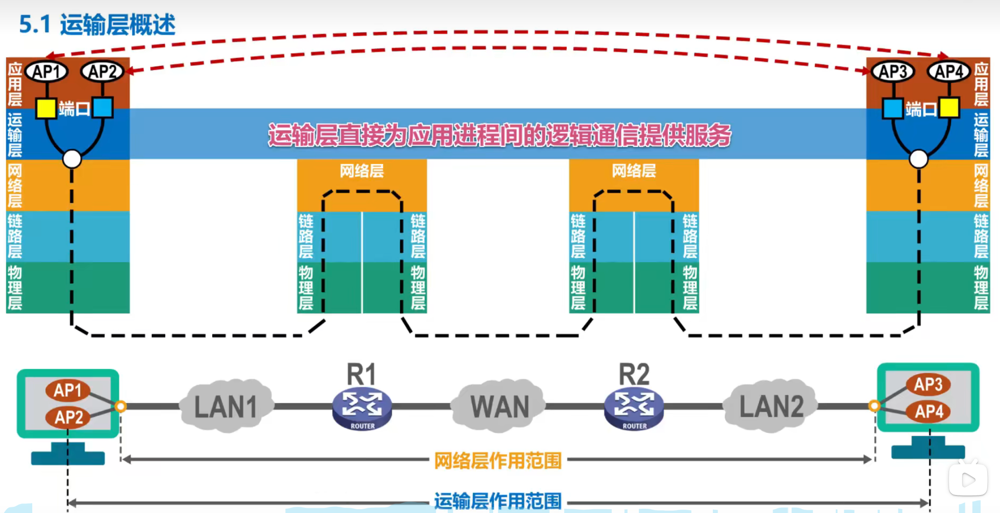

## 2. 运输层端口号、复用与分用的概念
TCP／IP体系的运输层使用端口号来区分应用层的不同应用进程。端口号使用16比特表示，取值范围0～65535；

||端口范围|作用|例子|
|-|-|-|-|
|熟知端口号|0～1023|为TCP／IP体系中最重要的一些应用协议使用|FTP使用21／20，HTTP使用80，DNS使用53|
|登记端口号|1024～49151|为没有熟知端口号的应用程序使用|Microsoft RDP 微软远程桌面使用的端口是3389|
|短暂端口号|49152～65535|留给客户进程选择暂时使用|无|
> 端口号只具有本地意义，即端口号只是为了标识本计算机应用层中的各进程，**在因特网中，不同计算机中的相同端口号是没有联系的。**

复用和分用：
||含义|
|-|-|
|复用|多个用户使用一个IO资源 **发送消息**|
|分用|多个用户使用一个IO资源 **接收消息**|

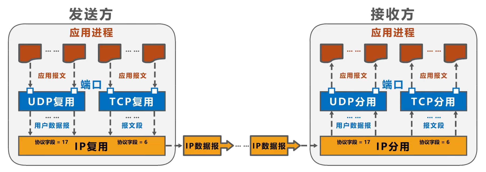

TCP/IP体系的应用层常用协议所使用的运输层熟知端口号：
|属于UDP的协议|端口号|属于TCP的协议|端口号|
|-|-|-|-|
|RIP|520|SMTP|25|
|DNS|53|FTP|21/20|
|TFTP|69|BGP|179|
|SNMP|161|HTTP|80|
|DHCP|67/68|HTTPS|443|

> IP首部中协议字段的值，表明了IP数据报封装的是TCP协议还是UDP协议；TCP协议字段为17，UDP协议字段为6

## 3. UDP和TCP的对比
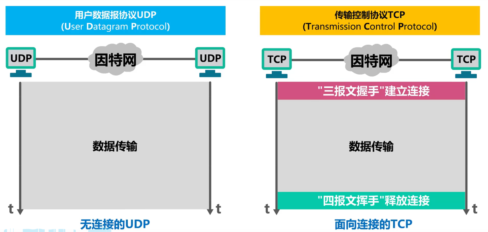

UDP: 用户数据报协议
- 无连接
- 支持单播(一对一)、多播(一对多)、广播(多对全)
- 面向应用报文
- 向上层提供无连接不可靠的传输服务(检测出误码仅仅丢弃数据)
- 适用应用：IP电话、视频会议等实时应用

TCP: 传输控制协议
- 面向连接
- 仅支持单播
- 面向字节流
- 向上层提供面向连接可靠传输的传输服务(不会出现传输差错)
- 适用应用：文件传输

||UDP|TCP|
|-|-|-|
|通信方式|无连接|面向连接|
|数据传输方式|支持单播、多播、广播|支持单播|
|针对通信协议的传输方式|面向应用报文|面向字节流|
|传输服务|向上层提供无连接不可靠的传输服务|向上层提供面向连接可靠传输的传输服务|
|面向场景|IP电话、视频会议|文件传输|
|首部|8字节(开销小)|20~60字节|

## 4. TCP的流量控制
定义：让发送方的发送速率不要太快，让接收方来得及接受

利用滑动窗口机制可以很方便地在TCP连接上实现对发送方的流量控制

> 滑动窗口: TCP 提供的⼀种机制，可以让「发送方」根据「接收方」的实际接收能力控制发送的数据量

例：

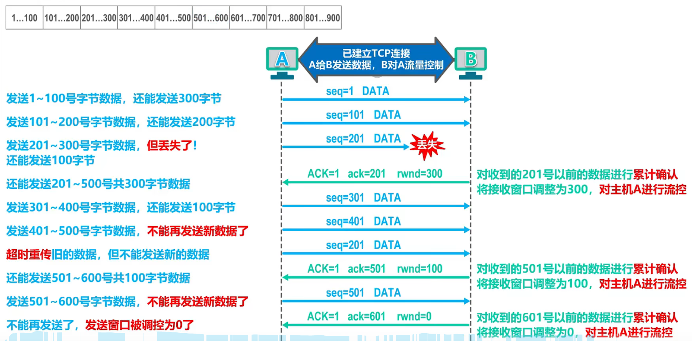
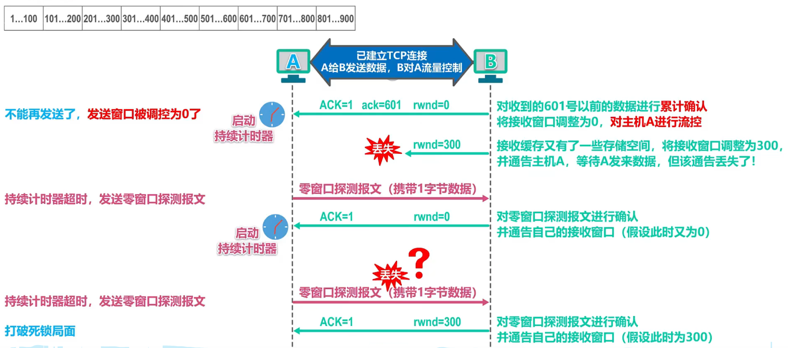

## 5. TCP的拥塞控制
拥塞：在某段时间，若**对网络中某一资源的需求超过了该资源所能提供的可用部分，网络性能就要变坏**。

若出现拥塞而不进行控制，整个网络的吞吐量将随输入负荷的增大而下降。

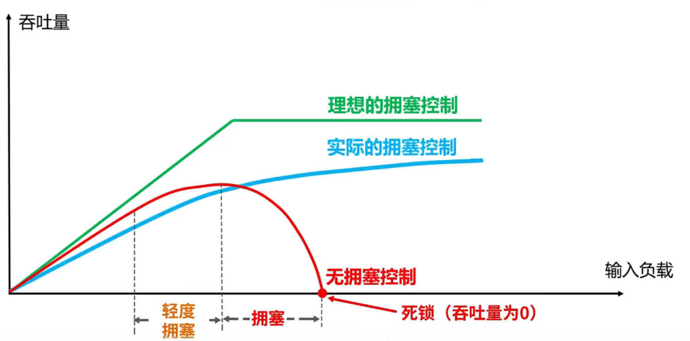

拥塞控制：

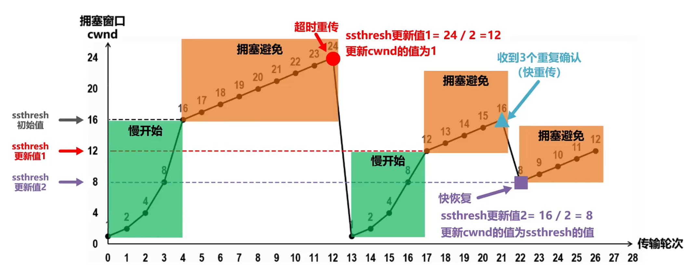

|慢开始|拥塞避免|快重传+快恢复|
|-|-|-|
|`cwnd ×= 2`|`cwnd += 1`|当收到三个重复确认，相应的报文段立即重传，且`cwnd = cwnd/2`，`ssthresh = cwnd`|
|当`cwnd >= ssthresh`时，改用拥塞避免算法|超时重传后，`ssthresh=cwnd/2`，`cwnd=1`|`cwnd=ssthresh + 3`(快恢复)，之后执行拥塞避免算法|
- 发送方维护一个叫做拥塞窗口cwnd的状态变量，其值取决于网络的拥塞程度，并且动态变化。
  - 拥塞窗口cwnd的维护原则：只要网络没有出现拥塞，拥塞窗口就再增大一些；但只要网络出现拥塞，拥塞窗口就减少一些。
  - 判断出现网络拥塞的依据：没有按时收到应当到达的确认报文（即发生超时重传）。
- 发送方将拥塞窗口作为发送窗口swnd，即swnd＝cwnd。

慢开始和拥塞避免：
- 维护一个慢开始门限ssthresh状态变量：
  - 当cwnd < ssthresh时，使用慢开始算法`cwnd ×= 2`；
  - 当cwnd >= ssthresh时，使用拥塞避免算法`cwnd += 1`；

快重传：
- 发送方一旦收到3个连续的重复确认，就将相应的报文段立即重传，而不是等到该报文段的超时重传计时器超时再重传
  
  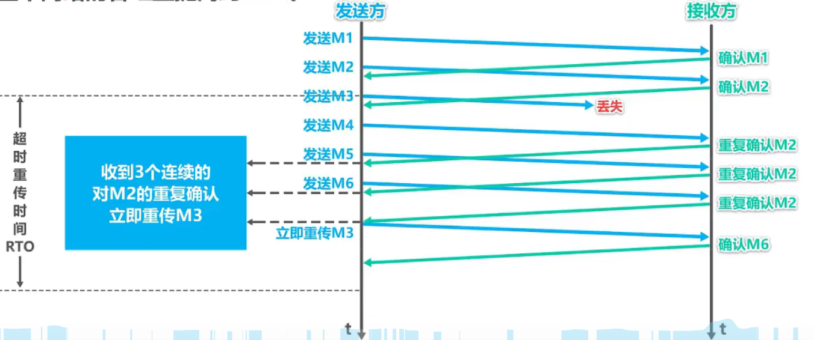

快恢复：
- 发送方一旦收到3个重复确认，就知道现在只是丢失了个别的报文段。于是不启动慢开始算法，而执行快恢复算法；
  - 发送方将慢开始门限ssthresh值和拥塞窗口cwnd值调整为当前窗口的一半；开始执行拥塞避免算法。
  - 有的快恢复会令`cwnd = ssthresh + 3`

## 6. TCP的超时重传
- $RTT_1$: 测量到的第一个RTT样本
- 加权平均往返时间$RTT_S$：
  - $RTT_{S1}=RTT_1$
  - $RTT_S=(1-\alpha)×RTT_S+\alpha×RTT$
  - $\alpha=\displaystyle\frac{1}{8}(0\leq\alpha<1)$
- $RTT$偏差的加权平均$RTT_D$：
  - $RTT_{D1}=\displaystyle\frac{RTT_1}{2}$
  - $RTT_D=(1-\beta)×RTT_D+\beta×|RTT_S-RTT|$
  - $\beta=\displaystyle\frac{1}{4}(0\leq\beta<1)$
- 重传时间$RTO$：

   $RTO=RTT_S+4×RTT_D$
> 出现超时重传时，$RTO=2×RTO$

## 7. TCP可靠传输的实现
TCP**以字节为单位的滑动窗口**来实现可靠传输

窗口大小：无需等待确认应答，⽽可以继续发送数据的最大值。

发送方发送的数据大小不能超过接收方的窗口大小，否则接收方就无法正常接收到数据

接受窗口和发送窗口的大小并不是完全相等，接收窗口的大小是约等于发送窗口的大小的。

TCP通常对不按序到达的数据是先临时存放在接收窗口中，等到字节流中所缺少的字节收到后，再按序交付上层的应用进程。

## 8. TCP连接建立（三次握手）
概念：
- SYN：同步位
- seq：序号字段
- ACK：确认位
- ack：确认号字段

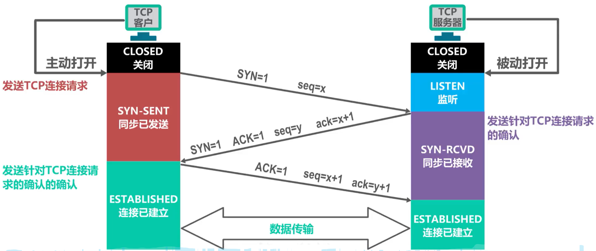

第三次报文握手的意义：防止已失效的连接请求报文段突然又传送到了TCP服务器，而导致错误。 
## 9. TCP连接释放（四次挥手）
概念：
- FIN：终止位
- MSL：最长报文段寿命 (RFC793建议为2分钟)

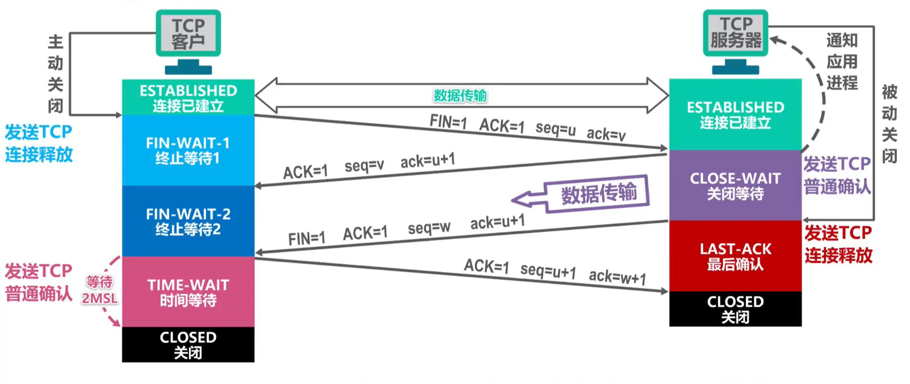

发送TCP普通确认后等待2MSL再进入关闭状态的意义：防止服务器未收到TCP普通确认，导致服务器无法进入CLOSED状态

## 10. TCP报文段首部
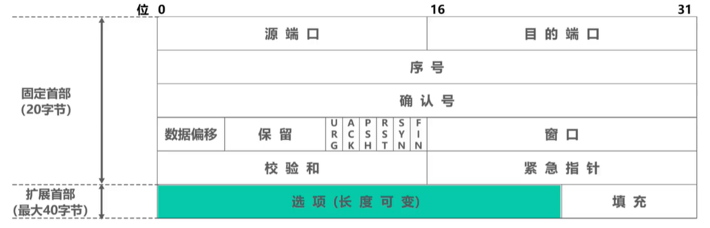