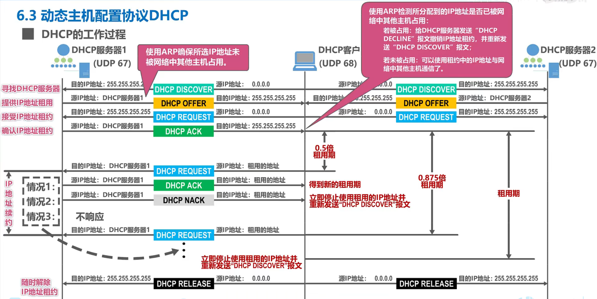
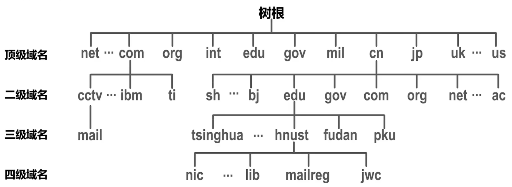
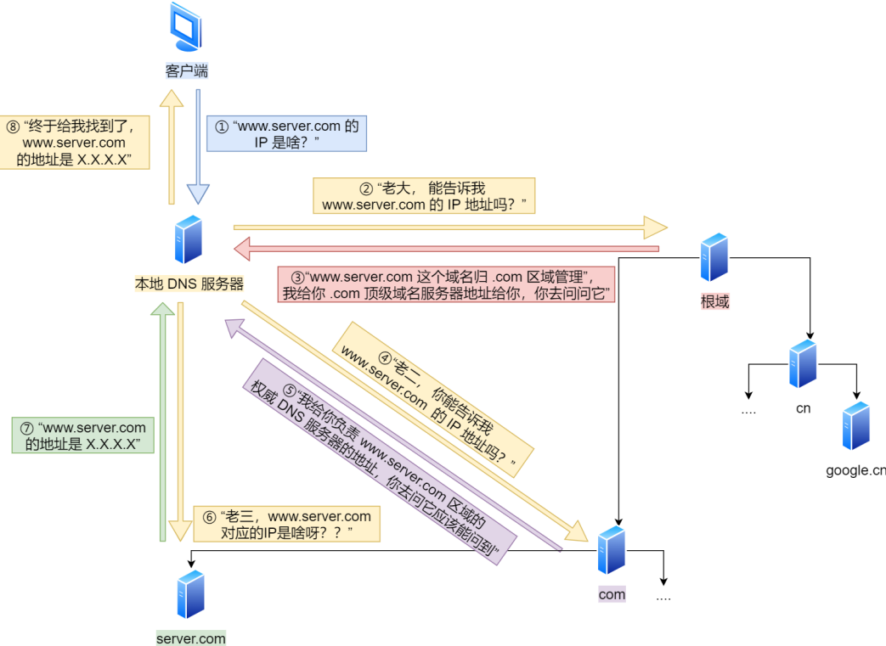
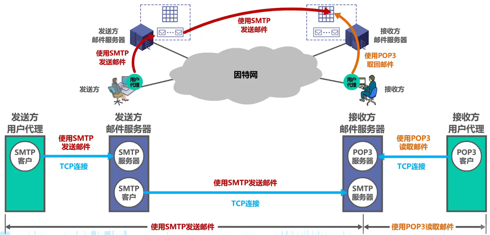

# 六、应用层
## 1. 应用层概述
应用层是计算机网络体系结构的最顶层，是设计和建立计算机网络的最终目的

## 2. 计算机网络架构
C/S方式：客户/服务器方式
- 客户是服务请求方，服务器是服务提供方。
- 服务器总是处于运行状态，并等待客户的服务请求。服务器具有固定端口号（例如HTTP服务器的默认端口号为80），而运行服务器的主机也具有固定的IP地址。
- C／S方式是因特网上传统的、同时也是最成熟的方式，很多我们熟悉的网络应用采用的都是C／S方式。包括万维网www、电子邮件、文件传输FTP等。
- 基于C／S方式的应用服务通常是服务集中型的，即应用服务集中在网络中比客户计算机少得多的服务器计算机上。
  - 在C／S应用中，常用计算机群集（或服务器场）构建一个强大的虚拟服务器。

P2P方式：对等方式
- 在P2P方式中，没有固定的服务请求者和服务提供者，分布在网络边缘各端系统中的应用进程是对等的，被称为对等方。对等方相互之间直接通信，每个对等方既是服务的请求者，又是服务的提供者。
- 目前，在因特网上流行的P2P应用主要包括P2P文件共享、即时通信、P2P流媒体、分布式存储等。
- 基于P2P的应用是服务分散型的，因为服务不是集中在少数几个服务器计算机中，而是分散在大量对等计算机中，这些计算机并不为服务提供商所有，而是为个人控制的桌面计算机和笔记本电脑，它们通常位于住宅、校园和办公室中。

## 3. DHCP(动态主机配置协议)
> DHCP交互中，全程都是使用UDP广播通信
- 作用：为网络中的各主机自动配置网络信息（IP地址、子网掩码、默认网关、DNS服务器、地址租期）
- 概念：
  - DHCP DISCOVER: DHCP发现报文
  - DHCP OFFER: DHCP提供报文
  - DHCP REQUEST: DHCP请求报文
  - DHCP ACK: DHCP 确认报文
  - DHCP NACK: DHCP 拒绝报文
- 工作过程：
  - 寻找DHCP服务器：客户端发起**DHCP DISCOVER**的IP数据报
    - 使用UDP广播通信
    - 目的地址为255.255.255.255（端口67）
    - 源IP地址0.0.0.0（端口68）
  - 提供IP地址租用：DHCP收到DHCP发现报文后，用**DHCP OFFER**客户服端做出响应
    - 目的地址为255.255.255.255
    - 携带信息：可租约的IP地址、子网掩码、默认网关、DNS服务器、地址租期
  - 接受IP地址租约：客户端收到一个/多个服务器的DHCP报文后，选择一个服务器，并向选中的服务器发送**DHCP REQUEST**进行响应，并回显配置的参数
  - 确认IP地址租约：服务端用 **DHCP ACK**对 DHCP 请求报文进行响应，应答所要求的参数
  - 如果租约的DHCP的IP地址快期后，客户端会向服务器发送DHCP REQUEST：
    - IP地址续约：服务器如果同意继续租用，则用DHCP ACK报文进行应答，客户端就会延长租期。
    - 随时解除IP地址租约：服务器如果不同意继续租用，则用DHCP NACK报文，客户端就要停止使用租约的IP地址，并重新发送DHCP DISCOVER。
  
  

- DHCP中继代理：
  - 给该路由器配置DHCP服务器的IP地址使之成为DHCP中继代理
  - 当该路由器收到广播的DHCP DISCOVER后，会将其单播转发给DHCP服务器
  - 有了 DHCP 中继代理以后，对不同网段的 IP 地址分配也可以由⼀个 DHCP 服务器统⼀进行管理

## 4. DNS
DNS域名解析：将域名网址自动转换为具体的IP地址

域名系统DNS：
- 在域名中，越靠右的位置表示其层级越高
- 域名的层级关系类似一个树状结构：
  
  
- 域名服务器可以划分为一下四种不同的类型：
  - 根域名服务器
  - 顶级域名服务器（com）
  - 权威域名服务器（server.com）
  - 本地域名服务器

域名解析流程：
- 客户端发送DNS请求给本地DNS服务器，询问`www.server.com`的IP是啥
- 本地DNS服务器收到客户端请求后，寻找对应IP地址
  - 先在本地DNS服务器缓存的表格里找
  - 找不到的话本地DNS回去问根DNS服务器
  - 接着向某个顶级DNS服务器查询
  - 接着向某个权威DNS服务器查询
  - 权威DNS服务器查询后将对应的IP地址X.X.X.X告诉本地DNS
  - 本地DNS将IP地址返回客户端，客户端和目标建立连接

  

## 5. FTP (文件传送协议)
文件传送协议FTP 是因特网上使用得最广泛的文件传送协议。
- FTP提供交互式的访问，允许客户指明文件的类型与格式，并允许文件具有存取权限。

## 6. 电子邮件
电子邮件系统采用C/S方式，且有三个主要构成构建：
- 用户代理（客户端）
- 邮件服务器
- 所需协议：
  - SMTP：简单邮件传送协议
  - POP：邮局协议；POP3端口号110
  - IMAP：因特网邮件访问协议；IMAP4端口号143
  
  

## 7. 万维网WWW
- 万维网使用统一资源定位符URL来知名因特网上任何种类"资源"的位置
- URL由四个部分组成：
  
  <协议>://<主机>:<端口>/<路径>
  - 例：http://www.hunst.cn:80/ggtz/119945.htm
- 万维网文档的组成
  - HTML (超文本标记语言)：使用多种“标签”来描述网页的结构和内容
  - CSS (层叠样式表)：从审美的角度来描述网页的样式
  - Javascript (一种脚本语言)：控制网页的行为
- 超文本传输协议HTTP: 定义了浏览器怎么向万维网服务器请求万维网文档，以及万维网服务器怎样把万维网文档传送给浏览器
  - HTTP／1.1相比HTTP／1.0性能上的改进：
    - 使用TCP长连接的方式改善了HTTP／1.0短连接造成的性能开销。
    - 支持管道（pipeline）网络传输，只要第一个请求发出去了，不必等其回来，就可以发第二个请求出去，可以减少整体的响应时间。
  - HTTP的报文格式：HTTP是面向文本的，其报文中的每一个字段都是一些ASCII码串，并且每个字段的长度都是不确定的。
  - 使用cookie在服务器上记录用户信息
    - 作用：可以解决HTTP无状态的问题
    - 当用户的进程初次向服务器进程发送HTTP请求报文时，服务器进程就会为其产生一个唯一的Cookie识别码 

- 万维网缓存与代理服务器
  - Web缓存把最近的一些请求和响应暂存在本地磁盘中。当新请求到达时，若发现这个请求与暂时存放的请求相同，就返回暂存的响应，而不需要按URL的地址再次去因特网访问该资源。